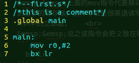

[原文链接](http://thinkingeek.com/2013/01/09/arm-assembler-raspberry-pi-chapter-1/)

---
&emsp;&emsp;在我看来，学习高等语言远比学习某一种特定的汇编器说明书更有用，
但是，自从我学习了386汇编，我开始着迷学习汇编语言，以上的东西可以让
我更好的理解下面我要写的内容。

### ARM简介
---
&emsp;&emsp;本文书写方式不以精通arm结构为目标，而是以务实的方式书写。
arm是一个以32位架构，拥有一个简单的目标：灵活性，这对于硬件厂商是个很好的方案
（因为他们在设计硬件时有更大的设计空间），但是对于软件开发者必须要对硬件差异必须
处理，所以本文假设一切都运行在Raspbian的Raspberry
Pi模型B上完成的（具有2个USB端口和512 MB RAM）。  <br>
&emsp;&emsp;一些部分将是ARM通用的，但其他部分将是Raspberry Pi特定的。
我不会区分。 ARM网站有很多文档。  <br>

### 编写汇编器
---
&emsp;&emsp;汇编语言是在二级制机器码上面的一个很薄的语法层  <br>
  <br>
&emsp;&emsp;二级制代码是机器运行代码，由指令组成，以二级制形式保存表示编码信息（这些编码在arm
手册中说明）,你也可以自己手动写二级制代码，但这是非常痛苦的（幸运的是我们除了一些Linux中的部分之外，
我们现在可以忽略）.  <br>
  <br>
&emsp;&emsp;所以我们开发了汇编器，包括ARM汇编器，由于计算机不能运行汇编代码，我们必须将汇编代码转化
位二级制机器代码，通过使用工具（assembler to assemble the assembler code）  <br>
  <br>
&emsp;&emsp;这个工具叫做as，特别是GUN Assembler，他是GUN项目的一部分，这个工具将会很好的将我们的
汇编代码转换位机器码  <br>
  <br>
&emsp;&emsp;打开编辑器，例如vim，emacs，nano,我们的汇编文件以“.s”为后缀，我也不知道为什么
  <br>
### 第一个程序
---
&emsp;&emsp;我们必须从最简单的例子开始，这个程序只返回一个错误码  <br>

```css
  /*--first.s */
  /*this is a comment*/
  .global main /* 'main' is our entry point and must be global */

  main:       /* This is main */
    mov r0,#2 /* Put a 2 inside the register r0 */
    bx lr     /* Return from main */
```
&emsp;&emsp;创建first.s文件，并且把上面的代码写入，保存。  <br>
&emsp;&emsp;通过下面的命令编译文件（在$符号后面）  <br>

```bash
$as -o first.o first.s
```
&emsp;&emsp;这将会创建first.o文件，接着运行链接脚本生产可执行文件  <br>
```bash
$gcc -o first first.o
```
$emsp;&emsp;如果没有错误，将会生产可执行文件，运行一下  <br>
```bash
$./first
```
&emsp;&emsp;没有显示任何东西，很失望？他的确做了一些事情，看一下错误码
```bash
./first ; echo $?
2
```
&emsp;&emsp;ok!,错误码是2，这不是偶然的，这是由于在上面的汇编代码中#2引起的  <br>
&emsp;&emsp;由于上面的这些编译和链接汇编代码很无聊，最好还是使用makefile自动完成  <br>
```makefile
#makefile
all: first
first: first.o
  gcc -o $@ $+

first.o: first.s
  as -o $@ $<

clean:
  rm -vf first *.o
```
### 看看发生了什么
---
&emsp;&emsp;我们可以做到比这更容易的方法，我们写一个main函数仅仅返回２，这样看起来更加
容易，因为Ｃ函数还需要我们初始化和销毁，我会一直使用这个简单的方法　　<br>
&emsp;&emsp;接下来我们一行一行的分析　　<br>
```css
/*--first.s*/
/*This is a comment*/
```
&emsp;&emsp;这些是注释，注释以/*开始和*/结束，使用注释会让编译器忽略这些注释内容，
不要在注释符号中嵌套使用注释符号，因为会导致不正常的工作　　<br>
```css
.global main /* 'main' 符号是我们的程序开始执行点，并且必须要全局（global标示）
```
&emsp;&emsp;这是一个GUN Assmbler的指令，这个指令告诉GUN Assmbler做一些特殊的处理
以（.）符号开始,后面是一些执行名字和一些指令参数，在当前这种指令下，我们说main是一个全局的名字
,这是必要的，因为C运行时会调用main函数，如果main函数不是全局的，C运行时将不能够调用main
并且链接失败
```css
main: /*This is main*/
```
&emsp;&emsp;并不是GUN Assembler中每一行指令都像 label:　instruction 这种指令，我们可以
忽略label:和instruction(空行或者空白都会被忽略),一行中只有label:　将会指向到下一行（我们
可以使用多了label:来只想同一个指令）,instruction就是ARM汇编语言部分，在上面的代码中，我们没有
使用指令部分  <br>
```css
　　mov r0,#2 /*把立即数２放到寄存器r0中*/
```
&emsp;&emsp;指令前面的空白将会被忽略，但是前面的缩进暗示者该指令输入main函数部分　　<br>
&emsp;&emsp;上面的mov指令代表移动，我们把数值２赋值给了r0寄存器，在后面的章节，我们将会学习
到更多的寄存器，这种写法是很英语读写顺序刚好相反，但在ARM语法中，它总是在左边，我们将在下一章学习
ARM中的立即数，　　<br>
&emsp;&emsp;总之该指令会把２放在寄存器r0中（这将会覆盖在R0中保存的内容）  <br>

```css
  bx lr
```
&emsp;&emsp;bx指令意思是跳转到某个地方，我们不关心跳转点，分支将会改变程序执行的流程，ARM处理器
依次执行，一个接一个的执行，当执行完mov指令后，就会执行bx指令（几乎所有的处理器都会按顺序执行）
，分支通常用于改变程序的正常默认执行顺序，在上面的情况下，我们的分支会执行到lr寄存器分支，我们
现在只需要了解bx指令只是为了离开主函数，从而结束我们的程序　　<br>

&emsp;&emsp;错误码？main函数的返回的结果是程序的错误码，当函数离开时，函数输出将会被保存到
寄存器r0中，main函数中执行的mov指令实际上将返回值设置位２  <br>

### 练习
---


