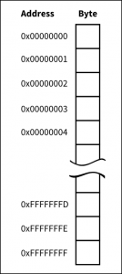
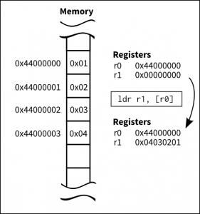

[原文链接](http://thinkingeek.com/2013/01/11/arm-assembler-raspberry-pi-chapter-3/)

&emsp;&emsp;我们在前面的章节１和章节２我们向寄存器中赋值(使用了mov指令)和求两个寄存器
之和(使用了add指令)，如果我们的处理器只能执行寄存器，而不能操作内存的话，就太限制了。

### 内存
---
&emsp;&emsp;计算器有内存保存代码(汇编代码的.text部分)和数值,所以处理器必须能够访问
内存，随便说一句，在386和X86-64结构中，指令可以访问寄存器或者内存，所以我们可以求两个
数值之和，其中一个也可以保存在内存中，在ARM指令中，并不是所有的参数都要是寄存器，我们
可以通过在内存中读取数据到寄存器或者从寄存器中保存数据到内存中来解决参数不全是寄存器的问题。

&emsp;&emsp;在ARM中有两个指令，加载和储存，分别对应指令符号位load 和store,有很多中方式可以实现，但是现在我们专注于指令ldr和指令str.

&emsp;&emsp;内存加载数据有点复杂，我们先了解一下地址

### 地址
---
&emsp;&emsp;我们先要给地址一个名字，以方便我们访问它的内容，当然，计算机中的每快内存部分是拥有不一样的名字，事实上这些名字就叫做地址，地址是一个32位的数字，标识内存器中的每个字节(8位)


&emsp;&emsp;当我们读取或者保存数据时，我们需要计算得到地址，每一种获取地址的不同方式成为寻址模式，ARM拥有好几种寻址模式，这里我们只考虑一种寻址模式：寄存器寻址。

&emsp;&emsp;ARM地址是设计为32位的地址，并不是偶然的一个数值，这意味着我们可以在寄存器中保存这些地址，只要我们保存了地址，我们就可以使用该寄存器来加载或者保存一些数据。
### 数据
---
&emsp;&emsp;我们在第一章节看到了汇编语法中包括代码(叫做text区)和数据区，我以前描述区域故意说的很简单，现在我们可以更深的理解，汇编语法中的标签是当前地址的别名，这些地址即可代指数据或者代码，到目前为止，我们只使用了一个main标签来指定我们的主函数地址，请记住，标签是地址的注释，而不是内容。　　<br>

&emsp;&emsp;我过去说过汇编语法只是机器码上的一层轻量级语法，现在看起来比较厚，因为汇编工具(as)会把标签转换成程序中运行的地址，我们可以使用标签是因为汇编器做一些神奇的事情，让程序可以成功运行。　　<br>

&emsp;&emsp;我们可以定义一些数据和标签给对应的地址，由程序员控制标签所对引用的存储具有适当的大小和值。　　<br>

&emsp;&emsp;让我们定义一个4字节的变量，并初始化位值位3，我们定义标签为myvar1
```css
.balign 4
myvar1:
  .word 3
```
&emsp;&emsp; 上面的例子有两个新的汇编指令,".balign"和".word"，当编译器遇到".balign"指令，编译器能确保下一个地址是以４字节边界开始，这意味着，下一个数据的地址（指令，也可以是数据）将会是４字节的整数倍，这是非常重要的，因为ARM对你可能工作的数据的地址施加了一些限制，如果地址已经是４字节的整数倍，则不会做出任何动作，否则，需要先填充一些程序用不到的字节来使下个地址位４字节对齐，从而满足要求，如果汇编器生成的地址都是４字节宽(4字节是32位),则我们可以省略此伪指令，但是一旦我们想使用不同大小的数据，该伪指令必将做一些行为。　　<br>

&emsp;&emsp;现在我们定义了myvar1的地址，因为上面的对齐伪指令，我们确保了我们的地址是４字节宽。　　<br>

&emsp;&emsp;".word"指令声明了汇编工具应该将指令参数的值作为４字节宽。在当前情况下，它将发出４字节宽的整数且值为3，前提是我们使用了.word伪指令定义了我们的整数只能位４字节宽。  <br>
### 部分
---
&emsp;&emsp;数据和代码一样一同驻存在内存中，由于一些使用的原因，现在我们并不关心，通常保存在一起，.data伪指令告诉汇编器在数据段中产生实体数据，和我们在第一章中看到的.text伪指令一样，因此，我们将数据段放在.data伪指令后面，并且放在.text段后面。
### 读取
---
&emsp;&emsp;我们从第2章可以找到一些代码，并且加访问内存的能力，我们定义了两个４字节宽的变量myvar1,myvar2并且初始化为3和4,和类似于第二章，我们将会使用ldr指令加载他们的值，运行并且最后输出错误码为7.
```css
/*--load01.s*/
/*--Data section*/
.data

.balign 4
myvar1:
  .word 3

.balign 4
myvar2:
  .word 4

/*--code section*/
.balign 4
.global main
main:
  ldr r1,addr_of_myvar1
  ldr r1,[r1]
  ldr r2,addr_of_myvar2
  ldr r2,[r2]

/*Labels need to access data*/
addr_of_myvar1: .word myvar1
addr_of_myvar2: .word myvar2
```
&emsp;&emsp;因为编译器的限制，我们感觉有一点被欺骗了，正如你看到上面有４个ldr指令，我会尝试解释他们，首先，我们必须讨论以下连个标签　　<br>
```css
addr_of_myvar1: .word myvar1
addr_of_myvar2: .word myvar2
```
&emsp;&emsp;这两有连个标签，分别包含了地址myvar1和myvar2，你可能感到很迷惑，为什么我们已经定义了myvar1和myvar2标签，还要定义他们，其中一个详细的解释是，因为myvar1和myvar2保存在.data部分，因为存在.data部分，所以我们的程序要可以修改它，这就是为什么要多两个标签，另一方面，代码通常不会被修改(处于效率和安全等原因),如果有两个不同部分具有不同属性附加到它们，但是我们不能直接访问另一个部分的符号，因此，在.code段中需要一个特殊的标签，来指向.data段中的另一个实体地址。　　<br>

&emsp;&emsp;当编译器生成二进制机器码，指令.word　myvar1并不是myvar1的地址，而是重定向（重定向指的是编译前假设一个地址，这个地址具体多少目前不知道，直到程序链接(当加载一个可执行文件)的时候才会知道地址）,就像，我当前不知道具体地址，让链接器告诉你真实的地址，所以，addr_of_myvar1会被真实替换，在.text段的addr_of_myvar1的真实数值，会在链接器链接phase(当可执行程序创建，并且放置程序代码中的各种段放在相应的内存中)，这也就是为什么连接器叫做ld,因为它代表这link eDitor(链接编辑)　　<br>

```css
ldr r1,addr_of_myvar1/* r1<-- &myvar1 */
ldr r1,[r1]/* r1 <-- *r1 */
```
&emsp;&emsp;上面的第一行实际加载了myvar1的重定向地址值，在内存中，有一些数值，其地址为addr_of_myvar1,大小为４字节，包含了真实的myvar1的地址，当执行位第一行代码后，r1中保存着myvar1的真实地址，但是我们不想只知道地址，而是该地址中的内容，所以才有第二行代码来使用ldr来加载内容。  <br>

说明：假设上图是给出的内存内容，上图变换展示了执行ldr指令的过程

&emsp;&emsp;获取你还在迷惑为什么上面的ldr指令格式不一样，第一个指令使用了addr_of_myvar1标签地址，第二个指令使用了寻址模式，在第二个情况下，我们使用了r1的值作为内存地址，在第一种情况下，我们暂时忽略汇编指令的寻址模式　　<br>

&emsp;&emsp;在上面的例子中，程序使用了两个ldr指令加载变量myvar1和myvar2，并且对于初始化位3和4，求他们的和并且把值作为程序退出主函数的寄存器r0中。　　<br>

```bash
./load01 ; echo $?
7
```
### 保存
---
&emsp;&emsp;我们使用上面的例子，但是修改myvar1和myvar2的初始化值，设置他们的初始化值皆为0，我们依旧使用上面的代码但是我们会在前面加一些指令来储存变量中３和4  <br>
```css
/*--store01.s--*/
/*--Data section*/
.data
.balign 4
myvar1:
  .word 0

.balign 4
myvar2:
  .word 0

/*--code section--*/
.text
.balign 4
.global main
main:
  ldr r1,addr_of_myvar1
  mov r3,#3
  str r3,[r1]
  ldr r2,addr_of_myvar2
  mov r3,#4
  str r3,[r2]

  /*same instructions as above*/
  ldr r1,addr_of_myvar1
  ldr r1,[r1]
  ldr r2,addr_of_myvar2
  ldr r2,[r2]
  add r0,r1,r2
  bx lr
/*label needed to access data*/
addr_of_myvar1: .word myvar1
addr_of_myvar2: .word myvar2
```
&emsp;&emsp;注意str指令的格式，第一个数不是指令的操作数，第一个数是源寄存器数，第二个数是寻址模式。　　<br>
```bash
./store01; echo $?
7
```
