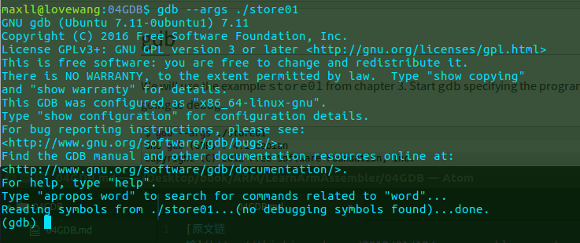

[原文链接](http://thinkingeek.com/2013/01/12/arm-assembler-raspberry-pi-chapter-4/)

&emsp;&emsp;我们开始学习ARM汇编语法的高级部分，我们的例子将会变得更长，我们很容易写错代码，我认为我们值得学习怎么使用GDB调试工具调试汇编代码，如果你开发C/C++程序在linux平台，而不会使用GDB,真是太挫了。如果你知道GDB,本章将会解释使用如何使用GDB调试汇编代码。　　 

### GDB
---
&emsp;&emsp;我们将会使用上一章节的store01例子，启动GDB并且指定要调试的代码。

&emsp;&emsp;我们启动GDB交互模式，在这种模式下，我们可以直接使用命令，这里有有个内建的帮助命令，或者你可以查看[GDB调试文档](http://sourceware.org/gdb/current/onlinedocs/gdb/)，第一个命令是

